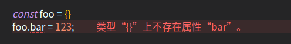

<!--
 * @Author: your name
 * @Date: 2021-11-05 10:37:15
 * @LastEditTime: 2021-11-05 10:41:39
 * @LastEditors: Please set LastEditors
 * @Description: 打开koroFileHeader查看配置 进行设置: https://github.com/OBKoro1/koro1FileHeader/wiki/%E9%85%8D%E7%BD%AE
 * @FilePath: /stonelang_ts/docs/typescript类型断言.md
-->
# 类型断言

TypeScript 允许你覆盖它的推断，并且能以你任何你想要的方式分析它，这种机制被称为「类型断言」。TypeScript 类型断言用来告诉编译器你比它更了解这个类型，并且它不应该再发出错误。

类型断言的一个常见用例是当你从 JavaScript 迁移到 TypeScript 时：

```typescript
const foo = {};
foo.bar = 123; // Error: 'bar' 属性不存在于 ‘{}’
foo.bas = 'hello'; // Error: 'bas' 属性不存在于 '{}'

```


