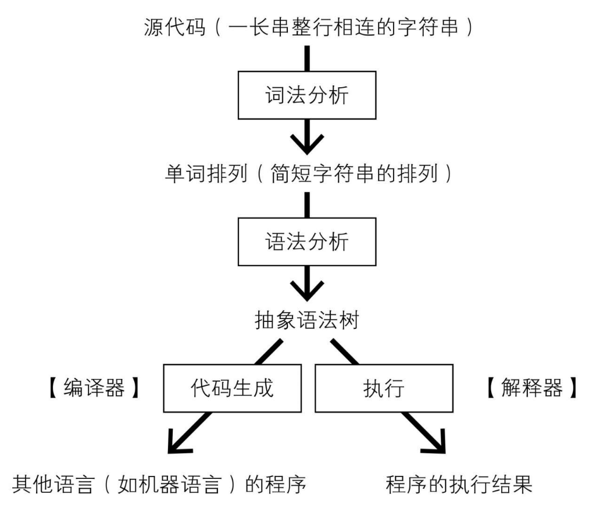
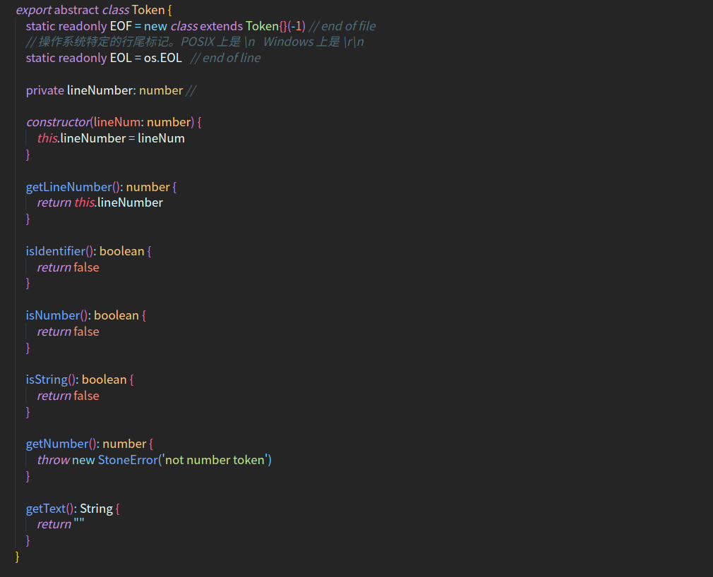

<!--
 * @Author: your name
 * @Date: 2021-09-01 20:04:55
 * @LastEditTime: 2022-07-21 19:46:51
 * @LastEditors: AlexZ33 775136985@qq.com
 * @Description: In User Settings Edit
 * @FilePath: /stonelang_ts/docs/设计语言.md
-->
使用typescript实现（implementation）一个脚本语言stonelang 


原书是使用Java实现，我们这里使用TypeScript(选择TypeScript语言，是为了以面向对象的方式设计语言处理器, 语言处理器的复杂度适中，常用于实验或论证各种语言范型的性能。)

 需要哪些语法功能:

- 整数四则运算
- 支持字符串处理
- 对变量提供支持(不然和计算器没区别了), 用户可以将变量任意赋值为整数或字符串(支持动态数据类型，无需事先声明变量)
- 支持条件语句 if  while
-  姑且算脚本语言，所以可以不需要指定静态数据类型，　
- 用户使用时也不必事先声明变量, 不需要指定变量类型
  - 用户可以将变量任意赋值为整数或字符串
  - 程序中出现字符串变量相减的语句，就会引起运行错误并终止
- 强制使用分号在句末(;)，如果正巧换行，分号可省略
- 不支持类似java语言中return 功能
- Stonelang语言为了简化语法，省去了if语句和while语句的条件表达式两侧的括号, 并允许用户省略可以省略的句尾分号
- 如果同一行中写多个语句，不能省略分号
- {}括起来的代码块最后一条语句的分号可以省略
- 空行被视为一句空语句，只不过省略了句尾的分号

将包括(需要解决的一些常见问题):
- [dangling-else问题](https://en.wikipedia.org/wiki/Dangling_else): 　因为语句体必须被大括号包围，所以不存在这个问题
  - 所以不支持else if : 

```golang
// 以下为逻辑代码
 if x > 0 {
    y = 1
 } else { if x ==0 {  // else与if之间不得不插入一个 {
    y = 0
 } else {
    y = -1
 }
```

- 


<b>不包括:</b>
- 不会通过正则表达式实现模式匹配的语法功能
  - 不会支持javascript语言的[正则表达式字面量](https://developer.mozilla.org/zh-CN/docs/Web/JavaScript/Reference/Global_Objects/RegExp)。（ruby里面也有）


    

示例:

```
// 这段程序是计算1至9这9个数字的和，并输出
sum = 0
i = 1 
while i < 10 {
    sum = sum + i
    i = i +1
}
sum // 最后一行只写了sum, Stone语言会将变量sum也视为一条语句,该语句将读取变量sum的值
```

示例2 
```
// 使用if语句, 分别计算其中奇数与偶数的和, 最后再将两者相加
even = 0
odd = 0
i = 1
while i < 10 {
    if i % 2 == 0 { // 如果是偶数
        even = even + i
    } else {
        odd = odd +i
    }
    i = i +1
}

even + odd 
```

将实现的是一个语言处理器，前置知识请阅读以下文章:

- [编译器&解释器](https://zhuanlan.zhihu.com/p/544349032)

语言处理器前半部分的程序结构都大同小异

- 1. 源代码首先将进行<b>词法分析</b>，由一长串字符串细分为多个更小的字符串单元(分割后的字符串称为单词)
- 2. 之后处理器将执行<b>语法分析处理</b>，把单词的排列转换为<b>抽象语法树</b>
- 3. 至此为止，解释器与编译器的处理方式相同。之后，编译器将会把抽象语法树转换为其他语言，而解释器将会一边分析抽象语法树一边执行运算
<b>首先需要把源代码转换为抽象语法树,  程序的分析结果能由抽象语法树表现，因此无论是解释器还是编译器都需要用到抽象语法树。</b>




## 脚本语言的结构
一般情况下， 脚本语言可以划分为几个部分:
- 1. 词法分析与语法分析
- 2. 类型对象 （数值，字符串，对象，等）
- 3.  栈 或者 环境
- 4. 虚拟机 或者 直接执行节点
- 5. GC部分

其中， 词法分析与语法分析存在一些第三方工具可以使用 (。(我们这里定义单词时使用了正则表达式。这样一来，就能够借助正则表达式库简单地实现词法分析器)
# 流程)

<b>虚拟机 与直接执行节点</b>
语法分析之后会生成一个抽象语法树（Abstract Syntax Tree，AST） ， 树里面存在很多个节点。

直接执行节点在初期的时候比较方便， 但是当逻辑越来越复杂，语言特性越来越多的时候，似乎就不是很好用了。 在跳转语句上， 直接执行节点没有虚拟机方便，简单。

虚拟机是使用AST生成一个线性执行的字节码序列， 配合栈一起进行运算。但是初期实现起来可能比较困难。

如果读者想实现一个现代化的脚本语言， 建议你直接使用虚拟机的方式进行实现， 因为这样前期麻烦，但是后期简单。 如果只是想了解一下， 则可以考虑使用直接执行节点的方式。(我们选择后者)
# 流程

```
SourceCode ~~ 扫描器((语法分析器) ~~> Token 流 ~~ 解析器 ~~> AST
```

# 一、词法分析器(lexical analyzer, lexer or scanner):  分割单词

> 词法分析：程序的源代码是一种相连的长字符串, 这样的长字符串很难处理，语言处理器通常先将字符串中的字符以单词为单位分组，　切割成多个字符串。　


## token对象

词法分析的结果称为单词(token),词法分析将筛选出程序的解释与执行必须的成分，单词之间的空白或者注释会在这一阶段被去除掉

词法分析器将把程序源代码视作字符串，并将它分割成若干单词。 分割后得到的单词并不是简单地用`String`对象表示，而是用下面这种Token对象，它将

- 记录单词对应的字符串
- 保存单词的类型
- 单词所处位置的行号等信息




Token类根据单词的类型， 又定义了不同的子类：(这里只把单词的种类限定为3种, 哈哈有点敷衍)

- stone语言包含`标识符 ` -->  Class NumToken 
- stone语言包含`整形字面量 ` --> Class  IdToken
- stone语言包含`字符串字面量 `--> Class  StringToken


         